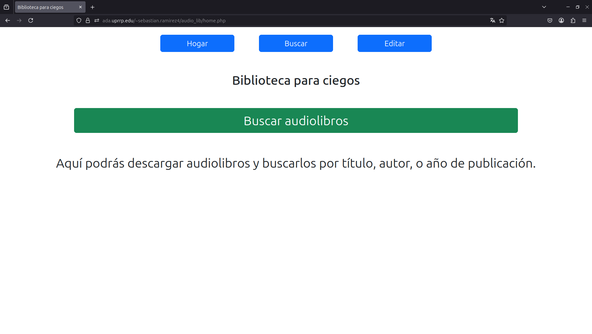
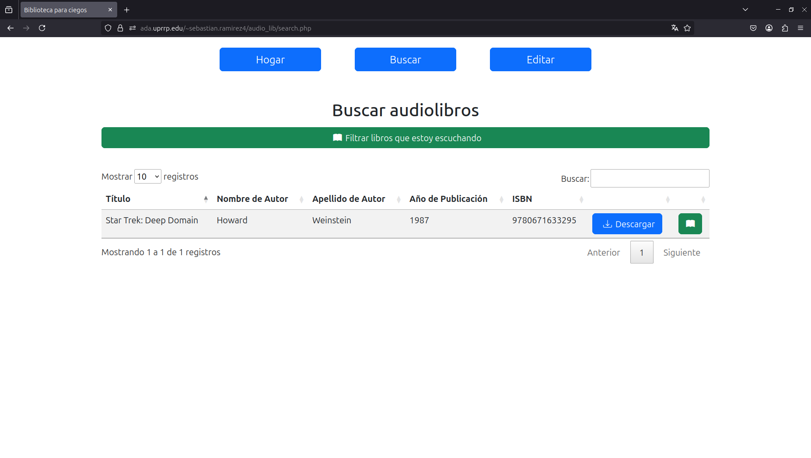
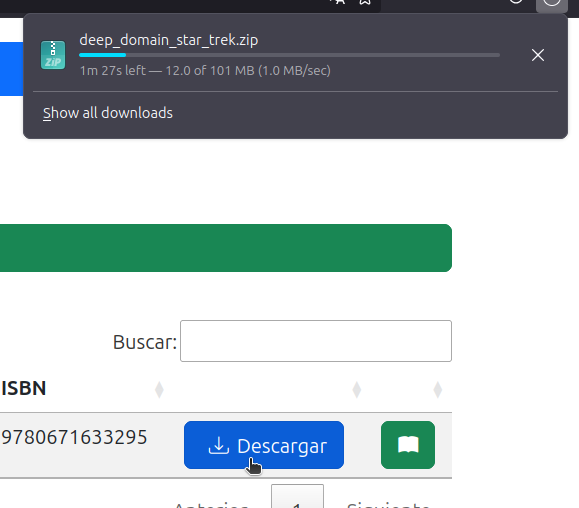
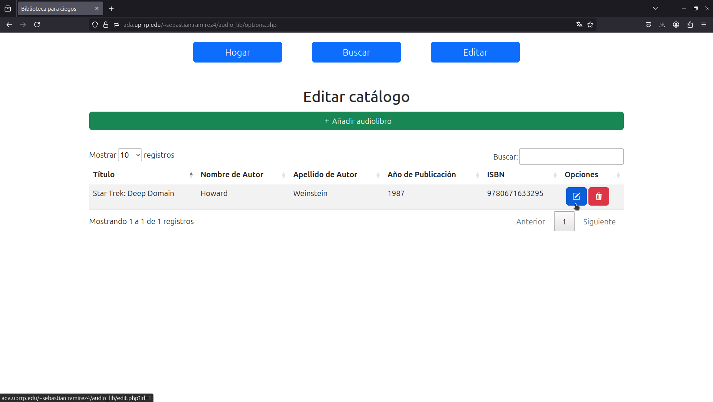
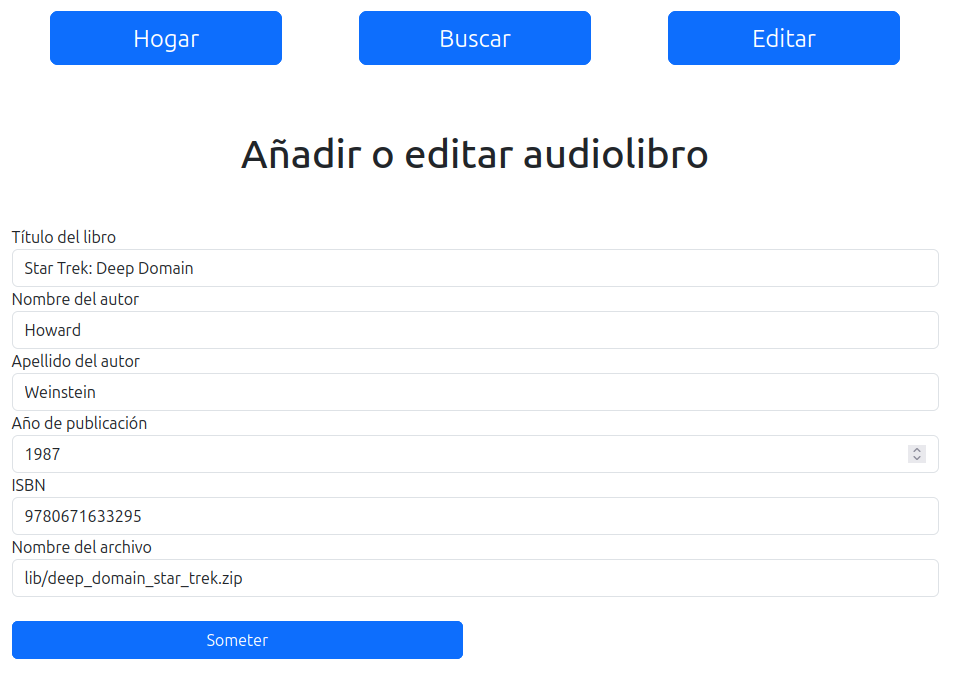

# Biblioteca para ciegos

CCOM4027: Introducción al Manejo de Datos \
Proyecto final

## Descripción
Esta aplicación es una biblioteca virtual para ciegos con una interfaz intuitiva y accesible que permite al usuario buscar y descargar audiolibros fácilmente. El propósito es proveer acceso gratuito a un catálogo variado de audiolibros.

## Instrucciones

### Página principal

El usuario puede entrar a la página utilizando [este](https://ada.uprrp.edu/~sebastian.ramirez4/audio_lib/home.php) enlace.

Inmediatamente, se encontrará con la página principal.

Si le damos al segundo botón del menú superior o al botón verde en el centro, seremos redirigidos a la página de búsqueda.

### Búsqueda y descarga

Aquí podemos buscar por título, autor, año, y ISBN. También podemos escoger cuáles libros estamos leyendo y ver cuáles ya tenemos en esa lista utilizando los botones verdes. Para descargar un audiolibro, es tan sencillo como oprimir el botón azul en la penúltima columna de la tabla.

El archivo ZIP descargado ahora se puede extraer y exportar para ser reconocido por una máquina lectora.

### Editar y añadir audiolibros a la base de datos

Si oprimimos el tercer botón en el menú superior, nos encontraremos con la siguiente tabla:

Aquí podemos utilizar el botón verde para añadir un libro nuevo, el botón azul para editar un libro que ya existe, y el botón rojo para borrar un libro. Si intentamos editar el libro de "Star Trek: Deep Domain", veremos esta página:

Todos los campos se pueden editar libremente. El "path" del archivo en el último campo debe ser uno que ya exista en el sistema de archivos del servidor.

Si presionamos el botón verde para añadir, tendremos la misma página con todos los encasillados en blanco.